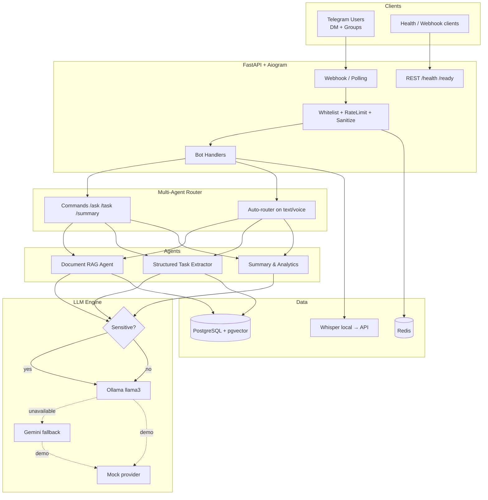
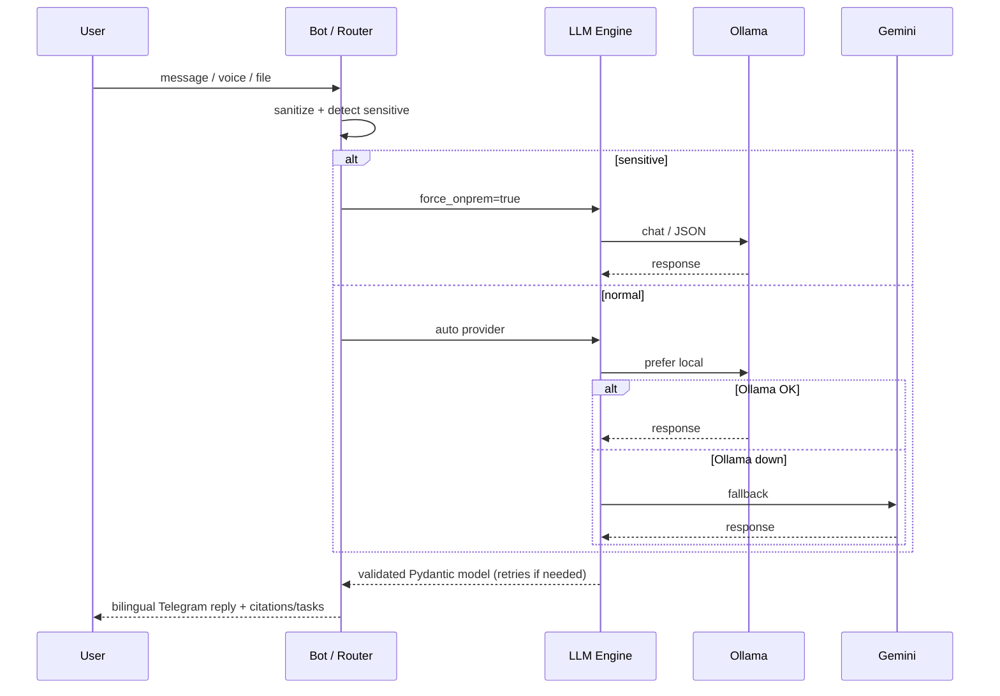

# Multi-Agent Telegram Bot

[](https://github.com/Dente22/multi-agent-telegram-bot/actions/workflows/ci.yml)
[](https://www.python.org/downloads/)
[](LICENSE)

Production-shaped **enterprise automation** service: **FastAPI** + **Aiogram 3.x** + **On-Premise Ollama** + **Gemini fallback** + **pgvector RAG** + **Pydantic v2 structured outputs**.

Demo-ready with mocks (no API keys). Scales to a full Docker Compose stack.

## Resume-aligned capabilities

| Capability | Implementation |
|---|---|
| On-Premise LLM | Sensitive requests forced through local **Ollama** only |
| RAG | PDF / TXT / DOCX → embeddings → **pgvector** + **source citations** |
| Structured Outputs | Task Extractor → strict JSON via **Pydantic v2** + **automatic retries** |
| Automated Workflows | Summary agent + auto-router for free text / voice |
| Safety | Prompt-injection sanitization, output redaction, whitelist, Redis rate limits |

## Architecture



### LLM policy



## Project layout

```text
app/
  api/          # FastAPI health + Telegram webhook
  bot/          # Aiogram handlers, middlewares, keyboards
  core/         # Config, DB, Redis, security, logging
  agents/       # Router, RAG, Extractor, Summary
  schemas/      # Pydantic structured outputs
  services/     # LLM engine, embeddings, pgvector, Whisper, mocks
  models/       # SQLAlchemy ORM
  main.py
docker/         # init-db.sql (CREATE EXTENSION vector)
alembic/        # Migrations
tests/
```

## Quick start

### 1. Clone

```bash
git clone https://github.com/Dente22/multi-agent-telegram-bot.git
cd multi-agent-telegram-bot
cp .env.example .env
```

### 2. Docker Compose (recommended)

```bash
docker compose up --build -d
```

| Service | Port | Role |
|---|---|---|
| `api` | 8000 | FastAPI + Aiogram |
| `db` | 5432 | PostgreSQL 16 + pgvector |
| `redis` | 6379 | Cache / rate limits |
| `ollama` | 11434 | On-prem LLM + embeddings |

Health check: http://localhost:8000/api/v1/health

### 3. Local tests (mocks, no Docker)

```bash
python -m venv .venv
# Windows: .venv\Scripts\activate
# Linux/macOS: source .venv/bin/activate
pip install -r requirements.txt
pytest -q
```

## Telegram bot

1. Create a bot with [@BotFather](https://t.me/BotFather)
2. Put the token in `.env` (never commit `.env`):

```env
TELEGRAM_BOT_TOKEN=your_token_here
LLM_PROVIDER=auto
USE_MOCKS=false
```

3. Recreate the API container:

```bash
docker compose up -d --force-recreate api
```

4. Message the bot: `/start`

### Commands

| Command | Agent | Description |
|---|---|---|
| `/start` | — | Welcome |
| `/help` | — | Help |
| `/ask <q>` | RAG | Answer with citations |
| `/task <text>` | Extractor | Structured JSON tasks |
| `/summary <text>` | Summary | Daily digest |

Also: **voice** (Whisper), **files** `.pdf` / `.txt` / `.docx`, **free text** (auto-router).

## Security

- `.env` is gitignored — only `.env.example` is in the repo
- No real API keys / bot tokens are stored in source
- Input sanitization (prompt-injection patterns EN/RU)
- Output redaction for accidental secrets
- Sensitive keyword gate → Ollama only
- Optional `ALLOWED_USER_IDS` / `ALLOWED_CHAT_IDS`
- Redis rate limiting; FastAPI protected by `X-API-Key`

## Configuration

See [`.env.example`](.env.example).

| Variable | Meaning |
|---|---|
| `LLM_PROVIDER` | `auto` \| `ollama` \| `gemini` \| `mock` |
| `USE_MOCKS` | Keyless demo mode |
| `WHISPER_MODE` | `auto` \| `local` \| `api` \| `mock` |
| `TELEGRAM_MODE` | `polling` \| `webhook` |

## Production checklist

1. `USE_MOCKS=false` + real `TELEGRAM_BOT_TOKEN`
2. Prefer webhook + TLS + `TELEGRAM_WEBHOOK_SECRET`
3. Restrict whitelist IDs; rotate `API_KEYS`
4. Run migrations: `alembic upgrade head`

## License

MIT — see [LICENSE](LICENSE).
